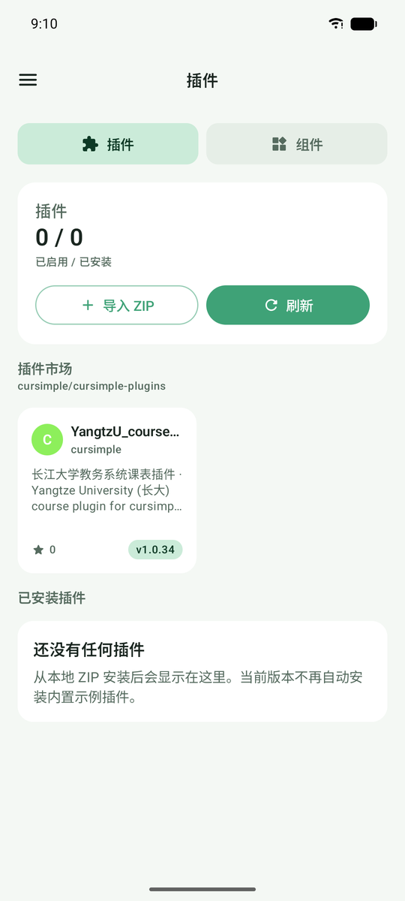

<div align="center">


# 课简 · CurSimple

**课表、提醒与桌面小组件，一个应用装下整个学期。**

微内核架构的开源 Android 课表应用。学校教务系统由独立插件适配，插件可单独更新，不必等应用发版。

[](https://github.com/cursimple/cursimple-app/actions/workflows/android-ci.yml)
[](https://github.com/cursimple/cursimple-app/actions/workflows/android-release.yml)
[](https://github.com/cursimple/cursimple-app/releases)
[](https://github.com/cursimple/cursimple-app/releases)

[](LICENSE)
[](https://kotlinlang.org)
[](https://developer.android.com/jetpack/compose)
[-3DDC84?logo=android&logoColor=white)](https://developer.android.com)

[下载安装](#下载安装) · [功能特性](#功能特性) · [插件系统](#插件系统) · [从源码构建](#从源码构建) · [English](README_en.md)

</div>

---

## 界面预览

<div align="center">

| 课表周视图 | 课表日视图 | 备忘录 |
|:--:|:--:|:--:|
|  |  |  |
| 节次平铺一屏，自己的事务按真实时间排进课表 | 左右滑动切换日期，事务插在各节课之间 | 每门课一个笔记本，清单、优先级与截止时间 |

| 双指缩放 | 上课提醒 | 设置 |
|:--:|:--:|:--:|
|  |  |  |
| 放大到 300% 任意拖动，表头与节次栏冻结 | 快上课时弹出课名、时间与地点，支持状态栏胶囊 | 搜索直达，「常用」放哪几项自己定 |

| 提醒设置 | 管理列表 | 插件市场 |
|:--:|:--:|:--:|
|  |  |  |
| 上课提醒与闹钟分开管理，按机型引导放行 | 课程与事务集中管理，可搜索 | 从 GitHub 注册表浏览并安装学校插件 |

</div>

## 功能特性

### 课表

| 能力 | 说明 |
|---|---|
| 周视图 / 日视图 | 周视图默认把全部节次平铺进一屏；日视图分页滑动，可见相邻日 |
| 事务 | 组会、社团、约球这类事按真实起止时间排进课表；和课撞上时并排显示，几件叠在一起合成「⋯」点开看；落在课间或早晚时自动插出一段，删掉后恢复原排版 |
| 双指缩放 | 在设置里打开后可放大到 300%，放大后任意方向拖动，表头与节次栏冻结在边上 |
| 跨节与单双周 | 连堂课渲染成整块，支持单周 / 双周 / 任意周次组合 |
| 临时调课与停课 | 指定某天改上另一天的课、整天调休，或只停某一门课 |
| 拖动调课 | 长按课程卡片拖到别的日子或节次，松手前二次确认，拖回原位即撤销 |
| 节假日与调休 | 放假安排每次打开 App 联网时静默更新，也可手动增补调休日 |
| 外观定制 | 文字、表头、卡片、网格线、背景图（可裁切）；所有颜色都用调色盘选 |
| 长课名自动缩小 | 按格子实际剩下的空间缩字号，课名和地点尽量都显示完整 |

### 备忘录

侧边栏的「备忘录」为每门课准备一个笔记本，也能记不属于任何课的事。支持复选框清单（卡片上直接勾选、显示进度）、优先级、置顶和截止时间；总览里一眼看到待办、今天到期与已逾期。编辑时所见即所得，列表、标题、引用、粗体直接渲染。

### 提醒

| 能力 | 说明 |
|---|---|
| 上课提醒 | 快上课时弹出课名、节次、时间与地点。样式有系统原生、品牌卡片、悬浮窗三种，悬浮窗支持毛玻璃与动效，可滑动收起 |
| 状态栏胶囊 | 支持实时活动的系统（Android 16、ColorOS 16、One UI 8.5 起等）在状态栏挂上课胶囊，通知栏单独置顶；小米澎湃 OS 走焦点通知 |
| 不漏提醒 | 提醒点错过了但还没上课，打开 App 时补发；分钟数按真实时间现算 |
| 静默守护 | 不常驻「正在守护」通知，退出 App 后定时巡检，被系统清掉的提醒与闹钟自动重新挂上 |
| 通知弹出引导 | 按这台手机列出需要放行的几项（通知、悬浮横幅、悬浮窗、胶囊、后台弹出），点一项直达系统设置 |
| 闹钟 | 精确闹钟，按「节次 + 条件 + 动作」规则生成；可选系统铃声或本地音频，响铃、震动或两者；闹钟响前可先弹一条预告 |
| 上课自动静音 | 按作息时间进出静音，下课自动恢复原有铃声模式 |

### 桌面小组件

三类小组件：今日课表、下一节课、提醒。点卡片空白处也能打开 App。刷新有四层保障：系统周期、WorkManager 周期、闹钟守护链，以及按节次边界（课前 5 分钟 / 上课 / 下课）对齐的精确刷新。

### 设置

顶部搜索框按名称、页面和关键词直达任意设置；「常用」单独一块，点「＋」挑选或把下面任意一项长按拖进来，格子长按可换位置；首页可在列表与网格视图之间切换。

### 数据

| 能力 | 说明 |
|---|---|
| 导入导出 | 本地 JSON 备份（含事务与备忘录）、二维码 / 口令交换课表、导出课表图片、导出 `.ics` |
| WebDAV | 备份与恢复到自建或第三方 WebDAV |
| AI 识图导入 | 从课表截图或拍照识别课程，需自行配置 API |
| 系统日历 | 把整学期写入手机日历，可一键撤销 |
| 学期档案 | 多学期并存，各自独立的课表、作息与周数 |

### 其他

- **多语言**：简体中文、繁體中文、English，应用内即时切换，不依赖系统语言
- **时区**：可脱离设备时区独立设置，跨时区上网课不用改系统设置
- **检查更新**：查到新版后直接点「更新」下载安装；默认只检查正式版，打开测试版更新后可收到预发布版
- **更新公告**：装完新版本首次进入时翻页展示本版亮点
- **架构分包**：`armeabi-v7a`、`arm64-v8a`、`x86`、`x86_64` 单架构包与 `universal` 通用包

## 下载安装

到 [Releases](https://github.com/cursimple/cursimple-app/releases) 下载对应架构的 APK：

| 文件 | 适用设备 |
|---|---|
| `app-arm64-v8a-release.apk` | 现代 64 位 ARM 手机（绝大多数设备选这个） |
| `app-armeabi-v7a-release.apk` | 较旧的 32 位 ARM 设备 |
| `app-x86_64-release.apk` | Intel 架构设备与模拟器 |
| `app-universal-release.apk` | 不确定架构时选这个，体积较大 |

版本号带 `-beta`、`-alpha` 等后缀的是预发布版，会标记为 Pre-release。

安装后首次启动：

1. 设置开学日期（课表页顶部提示按钮，或侧边栏进入）
2. 到**插件**页从插件市场安装对应学校的插件
3. 按插件说明登录教务系统并同步课表
4. 到**设置 → 上课通知 → 通知弹出引导**，按清单放行通知，提醒才能准时弹出

没有对应插件时，也可以在「管理列表」里手动添加课程和事务，或用二维码 / 图片识别导入。

## 插件系统

学校教务系统千差万别，课简把采集逻辑放在插件里：插件是一份 `manifest.json` 加一个 JS 包，在应用内的 WebView 会话中运行，负责登录、抓取与解析，最终吐出统一的课表模型。插件独立发版，学校改版只需更新插件。

### 安装插件

1. 进入**插件**页，浏览「插件市场」
2. 卡片显示插件名、作者、星标数、描述与最新版本
3. 点开查看详情，选择「安装」或「在 GitHub 查看」
4. 也可以用「导入 ZIP」从本地安装

插件市场的索引来自 [cursimple/cursimple-plugins](https://github.com/cursimple/cursimple-plugins)。

### 插件包要求

每个插件仓库至少要有一个 Release，并上传：

- `manifest.json`：声明插件元信息，其中 `filename` 指向插件包
- `manifest.json` 里 `filename` 所指的插件包文件

应用会依次读取 `releases/latest/download/manifest.json`，再按 `filename` 下载插件包。GitHub 自动生成的 Source code 压缩包不会被当作插件包。

开发自己的插件请看 [插件开发指南](docs/plugin-system.md)。

## 从源码构建

### 环境要求

- JDK 17
- Android SDK，含 `platforms;android-36`

### 构建

```bash
# Debug（applicationId 为 com.x500x.cursimple.ci，可与正式版共存）
./gradlew assembleDebug

# Release（四种 ABI 分包 + universal）
./gradlew assembleRelease

# 单元测试与静态检查
./gradlew testDebugUnitTest lintDebug
```

Release 签名通过 `keystore.properties` 配置，模板见 `keystore.example.properties`：

```properties
CLASS_VIEWER_KEYSTORE_FILE=.signing/class-viewer.jks
CLASS_VIEWER_KEYSTORE_PASSWORD=替换为仓库密码
CLASS_VIEWER_KEY_ALIAS=替换为密钥别名
CLASS_VIEWER_KEY_PASSWORD=替换为密钥密码
```

版本号只在 `gradle.properties` 里维护一处：

```properties
app.versionCode=30
app.versionName=0.7.4
```

### 模块结构

```
app              应用壳、依赖组装、入口页面、更新检查与下载镜像
core-kernel      统一课表模型与核心协议
core-plugin      插件 manifest、安装、组件、Web 会话模型与 GitHub 注册表
core-data        DataStore 仓储
core-reminder    提醒规则、计划与派发后端
feature-schedule 课表页面与同步逻辑
feature-plugin   插件市场界面与 WebView 会话
feature-widget   桌面小组件与定时刷新
```

### 持续集成

| 工作流 | 触发 | 内容 |
|---|---|---|
| `android-ci.yml` | PR 与推送到 `main` | 编译、单元测试、Lint |
| `android-release.yml` | 推送 `v*` 标签 | 校验标签与 `app.versionName` 一致，构建全部 ABI，生成 `update.json`，按版本后缀决定是否标记 Pre-release |

更详细的开发说明见 [高级文档](README_dev.md)。

## 常见问题

<details>
<summary><b>闹钟不响 / 提醒不准</b></summary>

先到**设置 → 上课通知 → 通知弹出引导**，按清单把没放行的几项打开；再到**设置 → 提醒与权限 → 权限**检查闹钟权限，里面有按手机品牌列出的「自启动」「后台弹出界面」「省电策略」入口。部分国产系统从`最近任务`划掉应用等同于强制停止，会连同闹钟一起清掉，这时只能等重新打开应用补回，可以在最近任务里把课简锁住。

</details>

<details>
<summary><b>插件安装失败</b></summary>

先确认网络可用，再检查插件仓库是否有有效 Release 以及 `manifest.json` 与其指向的插件包。国内网络下应用会并发竞速多个镜像，若全部失败可尝试切换 Wi-Fi 与移动数据。

</details>

<details>
<summary><b>课表不显示 / 周数不对</b></summary>

课表页顶部会显示当前周与学期。周数为空说明还没设置开学日期，点顶部提示按钮设置即可。插件同步后没有课程，先确认插件已启用，并到插件详情里重新触发同步。

</details>

<details>
<summary><b>小组件不刷新</b></summary>

允许应用后台运行；再到**设置 → 常用 → 小组件**确认配置。若仍不刷新，移除小组件后重新添加。

</details>

## 反馈与参与

- 缺陷与功能建议：[GitHub Issues](https://github.com/cursimple/cursimple-app/issues)
- 使用交流：[GitHub Discussions](https://github.com/cursimple/cursimple-app/discussions)
- 插件收录：向 [cursimple-plugins](https://github.com/cursimple/cursimple-plugins) 提交

## 开源许可

[MIT License](LICENSE) · Copyright © 2026 CurSimple 团队
