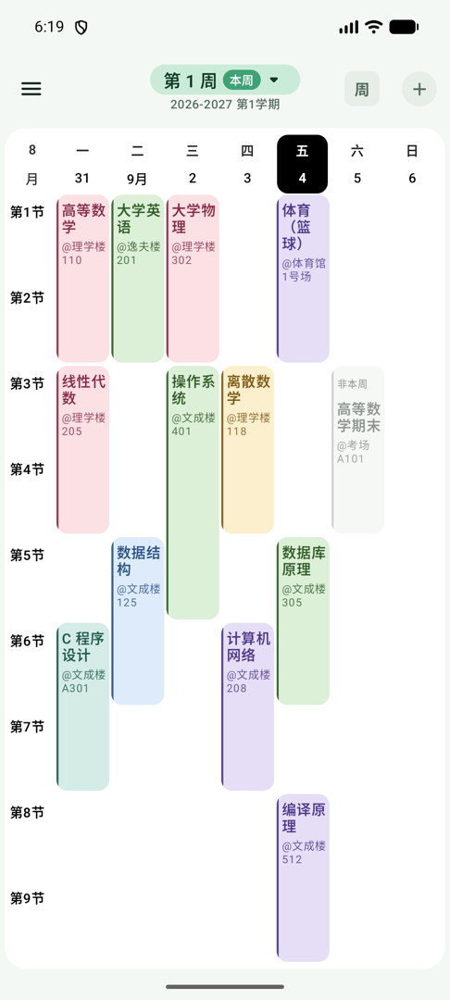
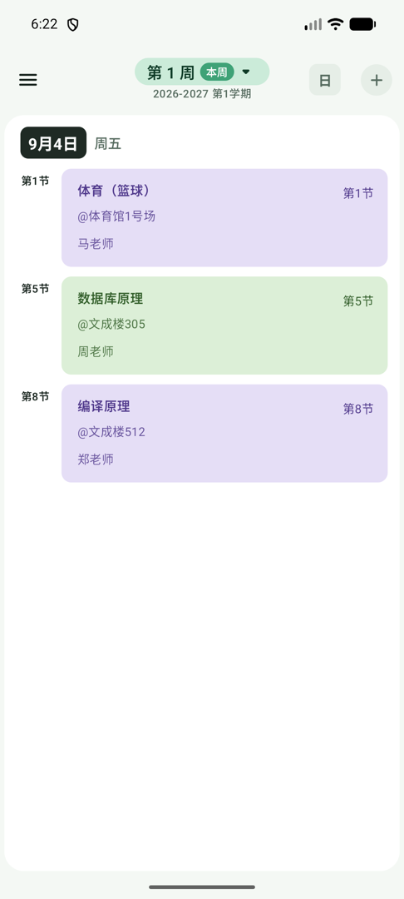
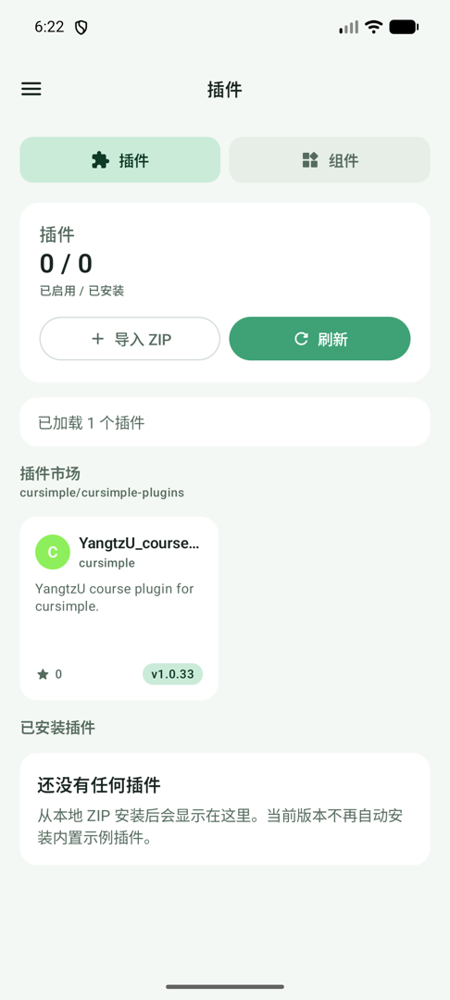
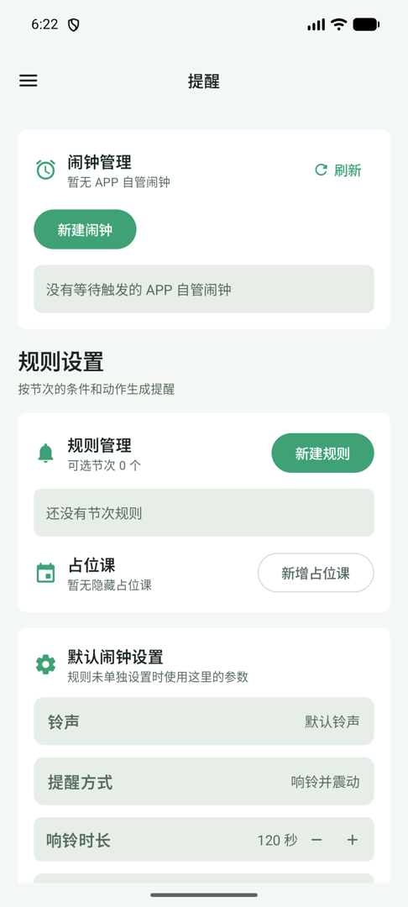
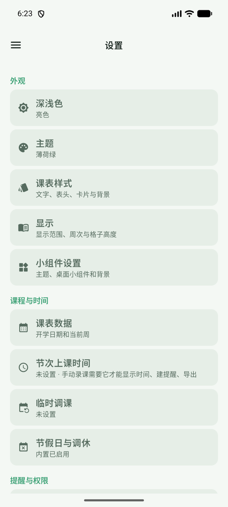
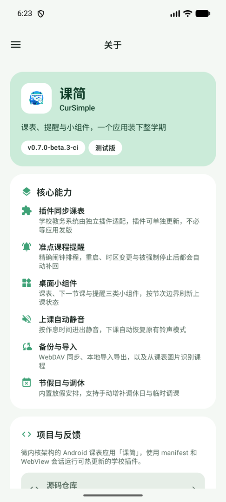

<div align="center">


# CurSimple

**Timetable, reminders and home screen widgets for the whole term.**

An open-source Android timetable app built on a microkernel architecture. Each school portal is handled by its own plugin, updated independently of the app.

[](https://github.com/cursimple/cursimple-app/actions/workflows/android-ci.yml)
[](https://github.com/cursimple/cursimple-app/actions/workflows/android-release.yml)
[](https://github.com/cursimple/cursimple-app/releases)
[](https://github.com/cursimple/cursimple-app/releases)

[](LICENSE)
[](https://kotlinlang.org)
[](https://developer.android.com/jetpack/compose)
[-3DDC84?logo=android&logoColor=white)](https://developer.android.com)

[Download](#download) · [Features](#features) · [Plugins](#plugin-system) · [Build from source](#build-from-source) · [中文](README.md)

</div>

---

## Screenshots

<div align="center">

| Week view | Day view | Plugin marketplace |
|:--:|:--:|:--:|
|  |  |  |
| Every period fits one screen, multi-period courses render as one block | Swipe between days, following your finger with the neighbours in view | Browse and install school plugins from the GitHub registry |

| Reminders | Settings | About |
|:--:|:--:|:--:|
|  |  |  |
| Rules built from period conditions, with per-rule alarm overrides | Six groups, nothing common buried more than two levels deep | Release channel, runtime and tech stack at a glance |

</div>

## Features

### Timetable

| Capability | Details |
|---|---|
| Week and day views | The week view fits every period on one screen by default; the day view pages between dates with the neighbours in view |
| Multi-period and alternating weeks | Consecutive periods render as one block; odd, even or arbitrary week sets are supported |
| Temporary changes | Swap one day's schedule for another day's, or clear a whole day |
| Holidays and make-up days | Built-in holiday data with online sync, plus manual make-up days |
| Drag to move | Drag a course card to another cell, with a confirmation before it lands |
| Appearance | Text size and colour, header, card radius and opacity, grid lines, background image with cropping |
| Light and dark | Custom colours can invert automatically to follow the system theme |

### Reminders

| Capability | Details |
|---|---|
| Exact alarms | Uses `USE_EXACT_ALARM`, granted at install, so Android 14+ does not deny scheduling by default |
| Self-healing | Missing alarms are reconciled after reboot, time zone change, locale change, and after a force stop when the app is next opened |
| Rule-based | Reminders come from period plus condition plus action, covering whole periods, the first class of the day, exams and more |
| Sound and mode | System ringtone or local audio; ring, vibrate or both, with adjustable duration and repeat count |
| Auto silence in class | Follows the period times and restores the previous ringer mode afterwards |

### Home screen widgets

Three Glance widgets, each spanning a full home row by default: timetable (4×2), next class (4×1) and reminders (4×2). Refresh has four layers — the system period, a WorkManager period, an alarm guard chain, and exact refreshes aligned to period boundaries (5 minutes before a class, at its start, and at its end) so the in-class state never lags.

### Data

| Capability | Details |
|---|---|
| Import and export | Local JSON backup, QR code and code-string exchange, timetable image export, `.ics` export |
| WebDAV | Backup and restore to a self-hosted or third-party WebDAV server |
| Image import | Recognise courses from a timetable screenshot or photo; bring your own API |
| System calendar | Write the whole term to the phone calendar, undoable in one tap |
| Term profiles | Multiple terms side by side, each with its own timetable, period times and week numbering |

### Elsewhere

- **Languages**: Simplified Chinese, Traditional Chinese and English, switched inside the app without touching the system locale
- **Time zone**: Set independently of the device, so online classes across time zones need no system change
- **Update channel**: Stable only by default; enabling beta updates surfaces prereleases, and turning it back off detects the stable release and offers a rollback
- **Release notes**: The first launch after an update shows what changed in that version
- **ABI splits**: `armeabi-v7a`, `arm64-v8a`, `x86`, `x86_64` and a `universal` package

## Download

Grab the APK for your device from [Releases](https://github.com/cursimple/cursimple-app/releases):

| File | Device |
|---|---|
| `app-arm64-v8a-release.apk` | Modern 64-bit ARM phones — pick this one unless you know otherwise |
| `app-armeabi-v7a-release.apk` | Older 32-bit ARM devices |
| `app-x86_64-release.apk` | Intel devices and emulators |
| `app-universal-release.apk` | Works everywhere, at a larger size |

Versions with a `-beta` or `-alpha` suffix are prereleases and are marked as such on GitHub.

After installing:

1. Set the term start date (the hint button on the timetable screen, or the drawer)
2. Open **Plugins** and install the plugin for your school from the marketplace
3. Sign in to the school portal through the plugin and sync your timetable

If no plugin covers your school, add courses by hand or import them from a QR code or an image.

## Plugin system

School portals differ wildly, so CurSimple keeps the scraping logic in plugins. A plugin is a `manifest.json` plus a JS bundle that runs inside an in-app WebView session, handling sign-in, fetching and parsing, and finally emitting the shared timetable model. Plugins ship on their own schedule, so a portal redesign only needs a plugin update.

### Installing a plugin

1. Open **Plugins** and browse the marketplace
2. Each card shows the name, author, star count, description and latest version
3. Open one for details, then choose Install or View on GitHub
4. Local bundles can be installed with Import ZIP

The marketplace index comes from [cursimple/cursimple-plugins](https://github.com/cursimple/cursimple-plugins).

### Bundle requirements

Every plugin repository needs at least one Release carrying:

- `manifest.json`, declaring the plugin metadata, whose `filename` points at the bundle
- the bundle file that `filename` names

The app reads `releases/latest/download/manifest.json` first, then downloads the bundle named by `filename`. GitHub's generated Source code archives are never treated as bundles.

To write your own, see the [plugin guide](docs/plugin-system.md).

## Build from source

### Requirements

- JDK 17
- Android SDK with `platforms;android-36`

### Commands

```bash
# Debug (applicationId com.x500x.cursimple.ci, installs alongside release)
./gradlew assembleDebug

# Release (four ABI splits plus universal)
./gradlew assembleRelease

# Unit tests and static analysis
./gradlew testDebugUnitTest lintDebug
```

Release signing is configured through `keystore.properties`; see `keystore.example.properties`:

```properties
CLASS_VIEWER_KEYSTORE_FILE=.signing/class-viewer.jks
CLASS_VIEWER_KEYSTORE_PASSWORD=replace with the keystore password
CLASS_VIEWER_KEY_ALIAS=replace with the key alias
CLASS_VIEWER_KEY_PASSWORD=replace with the key password
```

The version lives in exactly one place, `gradle.properties`:

```properties
app.versionCode=8
app.versionName=0.7.0-beta.3
```

### Modules

```
app              App shell, dependency wiring, entry screens, update checks and download mirrors
core-kernel      Shared timetable model and core contracts
core-plugin      Plugin manifest, installation, components, web session model and GitHub registry
core-data        DataStore repositories
core-reminder    Reminder rules, planning and dispatch backends
feature-schedule Timetable screens and sync logic
feature-plugin   Marketplace UI and WebView sessions
feature-widget   Home screen widgets and scheduled refresh
```

### Continuous integration

| Workflow | Trigger | What it does |
|---|---|---|
| `android-ci.yml` | Pull requests and pushes to `main` | Compile, unit tests, Lint |
| `android-release.yml` | Pushing a `v*` tag | Verifies the tag matches `app.versionName`, builds every ABI, generates `update.json`, and marks the release as a prerelease based on the version suffix |

Deeper development notes live in the [developer documentation](README_dev.md).

## Troubleshooting

<details>
<summary><b>Alarms do not ring, or reminders are late</b></summary>

Go through **Settings → Reminders and permissions → Permissions** and check notification and alarm access. Chinese OEM ROMs additionally need autostart and background execution granted in the system settings. Note that alarms wiped by a system force stop can only be restored the next time the app is opened; swiping the app away from Recents does not affect them.

</details>

<details>
<summary><b>A plugin fails to install</b></summary>

Check connectivity first, then confirm the plugin repository has a valid Release with both `manifest.json` and the bundle it names. On restricted networks the app races several mirrors in parallel; if all of them fail, try switching between Wi-Fi and mobile data.

</details>

<details>
<summary><b>The timetable is empty, or week numbers look wrong</b></summary>

The current week and term appear at the top of the timetable screen. A blank week number means the term start date is not set yet — use the hint button to set it. If a plugin synced but no courses appeared, confirm the plugin is enabled and trigger the sync again from its detail screen.

</details>

<details>
<summary><b>Widgets do not refresh</b></summary>

Allow the app to run in the background, then check **Settings → Appearance → Widget settings**. If it still lags, remove the widget and add it again.

</details>

## Feedback and contributing

- Bugs and feature requests: [GitHub Issues](https://github.com/cursimple/cursimple-app/issues)
- Questions and discussion: [GitHub Discussions](https://github.com/cursimple/cursimple-app/discussions)
- Plugin submissions: open a request on [cursimple-plugins](https://github.com/cursimple/cursimple-plugins)

## License

[MIT License](LICENSE) · Copyright © 2026 x500x
