<div align="center">


# CurSimple

**Timetable, reminders and home screen widgets for the whole term.**

An open-source Android timetable app built on a microkernel architecture. Each school portal is handled by its own plugin, updated independently of the app.

[](https://github.com/cursimple/cursimple-app/actions/workflows/android-ci.yml)
[](https://github.com/cursimple/cursimple-app/actions/workflows/android-release.yml)
[](https://github.com/cursimple/cursimple-app/releases/tag/v0.7.7)
[](https://github.com/cursimple/cursimple-app/releases/tag/v0.7.7)
[](https://github.com/cursimple/cursimple-app/releases)

[](LICENSE)
[](https://kotlinlang.org)
[](https://developer.android.com/jetpack/compose)
[-3DDC84?logo=android&logoColor=white)](https://developer.android.com)

[Website](https://cursimple.github.io/cursimple-app/) · [Download](#download) · [Features](#features) · [Plugins](#plugin-system) · [Build from source](#build-from-source) · [中文](README.md)

Latest beta: [0.7.7](https://github.com/cursimple/cursimple-app/releases/tag/v0.7.7) (`beta` / Pre-release).

</div>

---

## Screenshots

<div align="center">

| Week view | Day view | Notes |
|:--:|:--:|:--:|
| 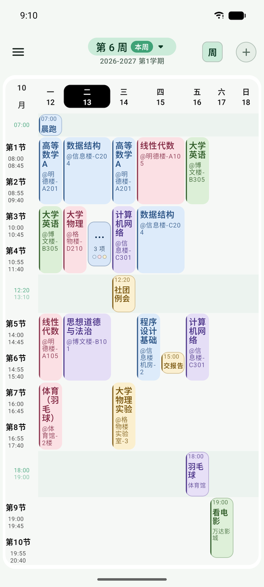 | 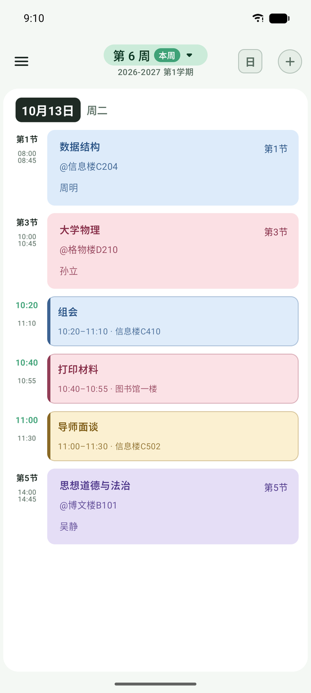 | 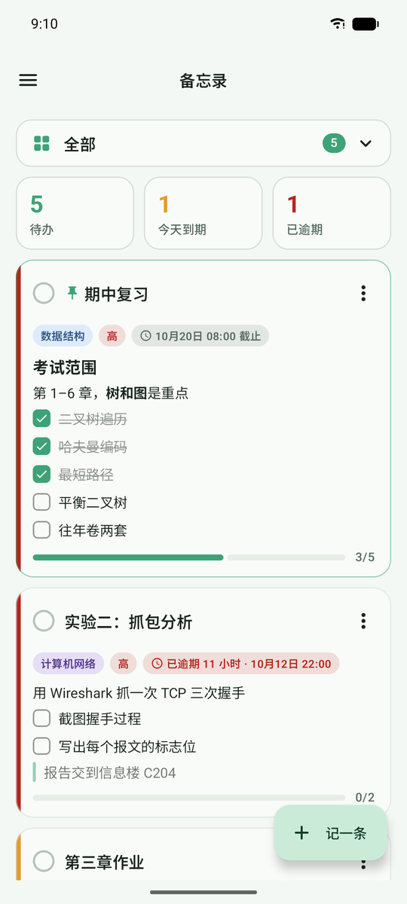 |
| Every period on one screen, with your own events placed at their real times | Swipe between days; events sit between classes | One notebook per course: checklists, priorities and due dates |

| Pinch to zoom | Class notice | Settings |
|:--:|:--:|:--:|
| 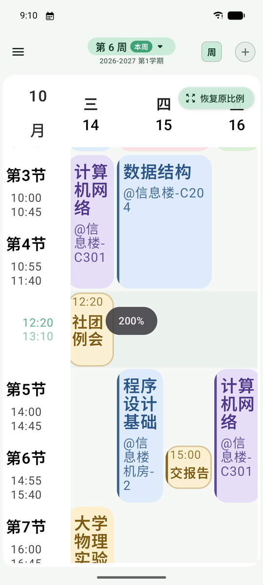 | 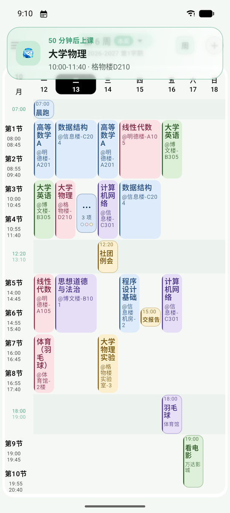 | 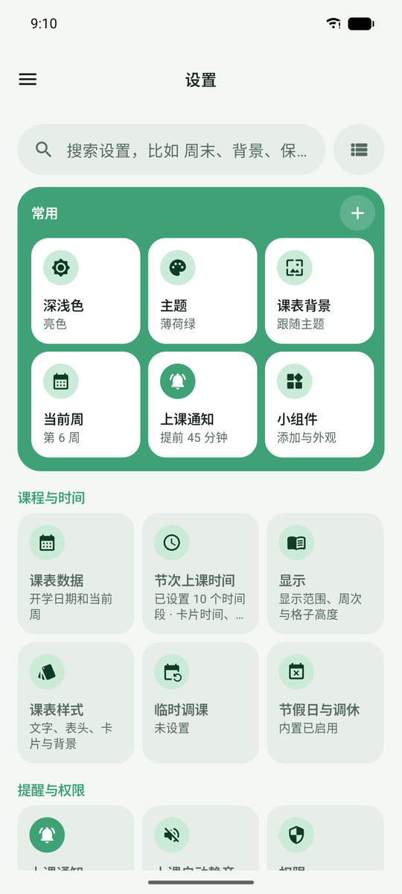 |
| Zoom up to 300% and pan freely; headers stay pinned | Course, time and room just before class, with a status bar chip | Search jumps straight to a setting; pick your own quick settings |

| Reminder settings | Manage list | Plugin marketplace |
|:--:|:--:|:--:|
| 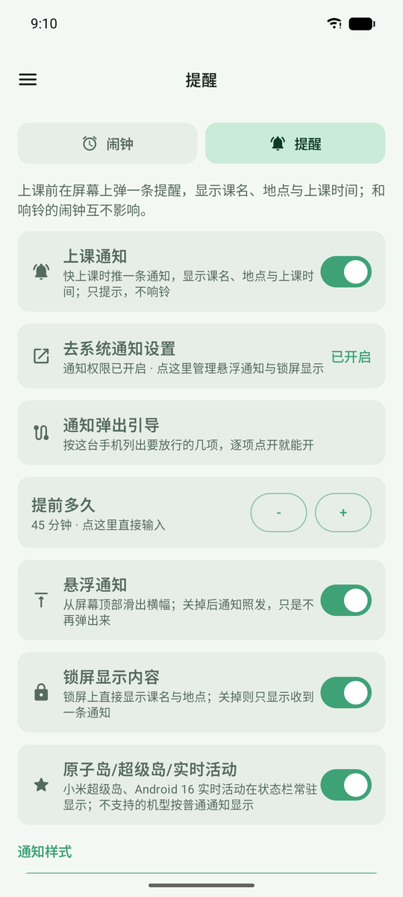 | 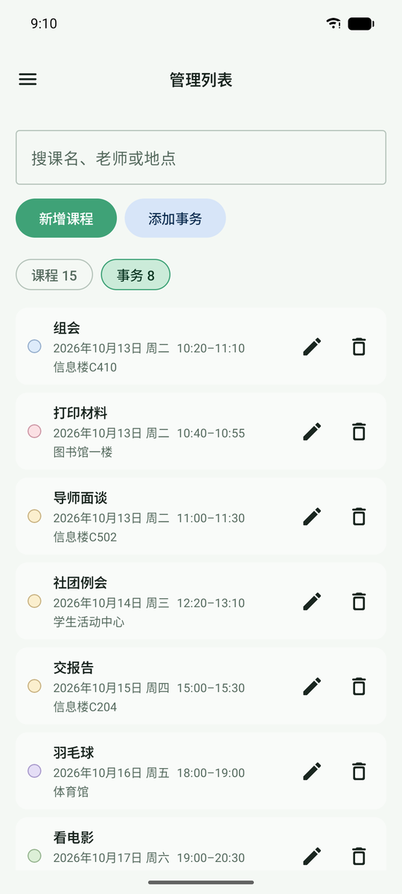 | 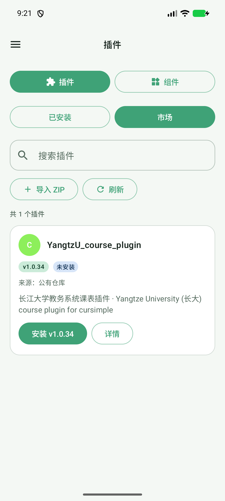 |
| Class notices and alarms managed separately, with a per-device setup guide | Courses and events in one searchable list | Search plugins and components; see sources, versions and installation status |

| Today's overview | Full-text note search | Alarm screen |
|:--:|:--:|:--:|
|  | 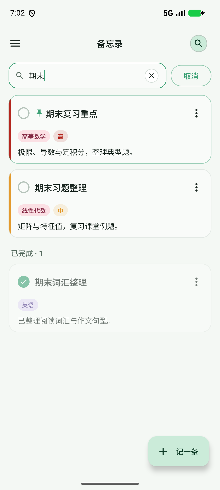 |  |
| Current and next class, countdowns, a full-day timeline and conflict details | Search titles, full text and courses across notebooks, including completed notes | Large clock, date and theme colours; slide to dismiss or tap to snooze |

| Course calendar widget | Pending tasks widget | Export to system Clock |
|:--:|:--:|:--:|
|  |  | 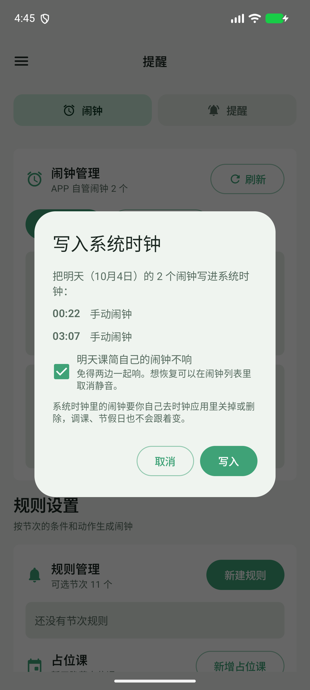 |
| Switch between a week timetable and month calendar; tap a date to open it | Unfinished items and due status from enabled components | Send tomorrow's alarms manually and verify them in Clock |

</div>

The new 0.7.5 screenshots use demo data.

## Features

### Timetable

| Feature | Details |
|---|---|
| Week / day view | The week view fits every period on one screen by default; the day view pages sideways and peeks at neighbouring days |
| Today's overview and timeline | Today's day view shows an overview by default: current / next class, class progress and countdowns to class start or end. Tap it for the full-day course timeline, conflict details and course details; turn it off under **Settings → Display → Show today overview** |
| Events | Meetings, clubs or a game of badminton go straight onto the timetable at their real start and end times. When they overlap a class they sit beside it, several overlapping events fold into a "⋯" you can open, and events outside class hours get their own band that disappears when the event is deleted |
| Pinch to zoom | Once enabled in settings, zoom up to 300% and drag in any direction; the day header and period column stay pinned |
| Multi-period and alternating weeks | Back-to-back periods render as one block; odd, even and arbitrary week patterns are supported |
| Make-up days and cancellations | Swap a day's classes for another day's, take a whole day off, or cancel a single course |
| Drag to reschedule | Long-press a course card and drop it on another day or period, confirm before it moves; drag it back to undo |
| Holidays and make-up workdays | The public holiday schedule refreshes silently whenever the app opens with a connection; extra make-up days can be added by hand |
| Appearance | Text, header, cards, grid lines and a croppable background image; every colour is picked from a palette |
| Shrink long titles | Font size follows the space actually left in the cell, so the title and room fit whenever they can |

### Notes

The **Notes** page in the drawer gives every course its own notebook, plus one for anything else. Notes support checklists you can tick right on the card (with progress), priorities, pinning and due dates; the overview shows what's open, due today and overdue at a glance. Editing is what-you-see-is-what-you-get: lists, headings, quotes and bold render as you type.

Search at the top right covers titles, the full body and course information across notebooks, including completed notes. Clearing or closing search restores your previous filters. The statistics at the top now fit in a compact row.

### Reminders

| Feature | Details |
|---|---|
| Class notices | A notice with the course, period, time and room just before class. Three styles: system, branded card and overlay; the overlay supports blur and animation and can be swiped away |
| Status bar chip | On systems with Live Updates (Android 16, ColorOS 16, One UI 8.5 and later, among others) a class chip sits in the status bar and the notice is pinned to the top of the shade; Xiaomi HyperOS uses focus notifications |
| No missed notices | If the reminder time was missed but class hasn't started, the notice is posted when you open the app; minutes are counted from the real clock |
| Silent guard | No persistent "guarding" notification: after you leave the app, periodic checks re-register any notices or alarms the system cleared |
| Setup guide | Lists exactly what this phone needs allowed (notifications, heads-up, overlay, chip, background pop-ups) and opens each system page directly |
| Alarms | Exact alarms generated from "period + condition + action" rules; system ringtones or local audio, ring, vibrate or both, with an optional heads-up before the alarm rings |
| Alarm screen | Large clock, date and course information in the app's theme colours; slide to dismiss or tap the snooze button |
| Holiday skipping and exceptions | Holiday alarms are skipped by default. Each alarm can allow ringing on holidays, while manually muted dates take priority; make-up class days still receive reminders. Skipped alarms send no pre-alarm notice, and date muting can be cancelled from the list |
| Manual system Clock export | Send tomorrow's eligible in-app alarms from the alarms page, merging items in the same minute. Items that cannot be written yet prompt you to return later; once all requests are sent and no items remain waiting, you can choose to mute CurSimple's alarms for tomorrow |
| Silence during class | Enters silent mode on schedule and restores the previous ringer mode after class |

The system Clock receives creation requests; open your phone's Clock app to verify that they succeeded. Exported alarms do not automatically follow rescheduling, cancellations or holiday changes and must be adjusted in Clock.

### Home screen widgets

| Widget | Details |
|---|---|
| Today's timetable | Courses for the selected date; switch dates or return to today |
| Next class | Current and next class information |
| Reminders | Upcoming course alarms |
| Course calendar | Switch between a week timetable and month calendar with courses, exams, events and holiday / workday markers. Page forwards or backwards, return to the current date, or tap a date to open its timetable |
| Notes checklist | Unchecked items from local notes, independent of extension components; tap an item to open its note |
| Component-owned widgets | Installed, enabled components explicitly declare their own widgets and ship their names, UI and content rules. The app supplies data, rendering, desktop binding and navigation interfaces |

Tapping empty space opens the app too. Refresh is layered four ways: the system period, a WorkManager period, the alarm guard chain, and exact refreshes aligned to period boundaries (5 minutes before class, class start, class end). Contextual messages for no classes, holidays, finished classes or empty task lists stay consistent throughout the day.

### Settings

The search box at the top finds any setting by name, page or keyword. **Quick settings** is its own block: tap + to choose what goes in, or long-press any item below and drag it up; long-press a tile to reorder it. The home page switches between list and grid layouts.

### Data

| Feature | Details |
|---|---|
| Import and export | Local JSON backup (including events and notes), timetable exchange by QR code or passphrase, timetable image export, `.ics` export |
| WebDAV | Back up to and restore from a self-hosted or third-party WebDAV server |
| AI screenshot import | Recognise courses from a screenshot or photo of a timetable; bring your own API |
| System calendar | Write the whole term into the phone's calendar, undoable in one tap |
| Term profiles | Several terms side by side, each with its own timetable, periods and week count |

### Elsewhere

- **Languages**: Simplified Chinese, Traditional Chinese and English, switched instantly inside the app, independent of the system language
- **Time zone**: Can be set independently of the device, so online classes across time zones don't need a system change
- **Updates**: Once a new version is found, tap **Update** to download and install it; only stable releases by default, prereleases after opting in to beta updates
- **Release notes**: The first launch after an update pages through the highlights of that version
- **Interface details**: Search fields, toolbar buttons, information cards and confirmation dialogs share a consistent style across the marketplace and Notes; long event text can be scrolled
- **Per-ABI builds**: `armeabi-v7a`, `arm64-v8a`, `x86`, `x86_64` and a `universal` APK

## Download

The latest beta is [0.7.7](https://github.com/cursimple/cursimple-app/releases/tag/v0.7.7). Download the APK for your device from that version's page; the [website](https://cursimple.github.io/cursimple-app/#download) also offers download mirrors and QR codes.

| File | Device |
|---|---|
| `CurSimple-arm64-v8a.apk` | Modern 64-bit ARM phones — pick this one unless you know otherwise |
| `CurSimple-armeabi-v7a.apk` | Older 32-bit ARM devices |
| `CurSimple-x86_64.apk` | Intel devices and emulators |
| `CurSimple-x86.apk` | 32-bit Intel devices |
| `CurSimple-universal.apk` | Works everywhere, at a larger size |

The release channel is set by `app.releaseChannel` in `gradle.properties`. Version 0.7.7 uses `beta`, keeps the tag `v0.7.7`, and sets `prerelease=true` on its GitHub Release; the older `v0.7.4` is also marked Pre-release. A version without a `-beta` suffix can still be a beta, so check the channel and Pre-release label. Enable beta updates in the app to receive this channel.

After installing:

1. Set the term start date (the hint button on the timetable screen, or the drawer)
2. Open **Plugins** and install the plugin for your school from the marketplace
3. Sign in to the school portal through the plugin and sync your timetable
4. Open **Settings → Class notice → Notification setup guide** and allow what it lists, so notices show up on time

If no plugin covers your school, add courses and events by hand in **Manage list**, or import them from a QR code or an image.

## Plugin system

School portals differ wildly, so CurSimple keeps the scraping logic in plugins. A plugin is a `manifest.json` plus a JS bundle that runs inside an in-app WebView session, handling sign-in, fetching and parsing, and finally emitting the shared timetable model. Plugins ship on their own schedule, so a portal redesign only needs a plugin update.

### Installing a plugin

1. Open **Plugins** or **Components**, switch between **Installed / Marketplace**, and search names, descriptions, school aliases and sources
2. Each card shows the name, author, star count, description, source, version and installation / update status
3. Open the description and repository details, then choose Install or View on GitHub. The version is checked again before installation; the dialog keeps a fixed size and scrolls internally, showing the description, source and actual package size first, with expandable permissions and verification details. Packages of **5 MiB** or more show actual downloaded bytes and a percentage when the total size is known
4. Local bundles can be installed with Import ZIP

Plugins and components have separate source lists, defaulting to [cursimple/cursimple-plugins](https://github.com/cursimple/cursimple-plugins) and [cursimple/cursimple-components](https://github.com/cursimple/cursimple-components). Under **Settings → Plugins**, add or remove sources using `owner/repo`, a GitHub repository link, or an individual plugin / component's Release repository. Sources load independently, so results from other sources remain visible if one fails.

Public sources need no login. For private repositories, paste a fine-grained GitHub personal access token (PAT) on the same settings page, select the required repositories and grant `Contents: Read-only`. Android Keystore encrypts the token on the current phone and it is excluded from backups. Private content and assets are fetched directly through the GitHub API; signing out or switching accounts clears account marketplace caches. Web device-code login is available only in builds configured with an OAuth Client ID.

### Extension components

The development host supports extension **API 9**: owned pages, confirmed read actions, ignore/restore, encrypted notification targets, restricted transport and resumable delivery status. Components install and update independently. The APK checks each bundle's API and minimum app version before writing files or records. Incompatible installs are blocked with a reason, and rejected upgrades preserve the existing version.

[YuKeTang notices](https://github.com/cursimple/YuKeTang_notice_plugin) and [multi-platform notifications](https://github.com/cursimple/cursimple-notify-component) are separate components. Real-account read synchronization and message receipt require end-to-end verification after binding.

### Bundle requirements

Every plugin repository needs at least one Release carrying:

- `manifest.json`, declaring the plugin metadata, whose `filename` points at the bundle
- the bundle file that `filename` names

The app reads the `manifest.json` asset from the plugin / component repository's latest Release, then downloads the bundle named by `filename`. Private repository assets are read through the signed-in account's GitHub API access. GitHub's generated Source code archives are never treated as bundles.

To write your own, see the [plugin guide](docs/plugin-system.md).

## Build from source

### Requirements

- JDK 17
- Android SDK with `platforms;android-36`

### Commands

```bash
# Debug (applicationId com.x500x.cursimple.ci, installs alongside release)
./gradlew assembleDebug

# Release (four ABI splits plus universal)
./gradlew assembleRelease

# Unit tests and static analysis
./gradlew testDebugUnitTest lintDebug
```

Release signing is configured through `keystore.properties`; see `keystore.example.properties`:

```properties
CLASS_VIEWER_KEYSTORE_FILE=.signing/class-viewer.jks
CLASS_VIEWER_KEYSTORE_PASSWORD=replace with the keystore password
CLASS_VIEWER_KEY_ALIAS=replace with the key alias
CLASS_VIEWER_KEY_PASSWORD=replace with the key password
```

The version and release channel are maintained in `gradle.properties`:

```properties
app.versionCode=31
app.versionName=0.7.7
app.releaseChannel=beta
```

### Modules

```
app              App shell, dependency wiring, entry screens, update checks and download mirrors
core-kernel      Shared timetable model and core contracts
core-plugin      Plugin manifest, installation, components, web session model and GitHub registry
core-data        DataStore repositories
core-reminder    Reminder rules, planning and dispatch backends
feature-schedule Timetable screens and sync logic
feature-plugin   Plugin and component marketplaces, shared UI controls and WebView sessions
feature-widget   Home screen widgets and scheduled refresh
```

### Continuous integration

| Workflow | Trigger | What it does |
|---|---|---|
| `android-ci.yml` | Pull requests and pushes to `main` | Compile, unit tests, Lint |
| `android-release.yml` | Pushing a `v*` tag | Verifies the tag matches `app.versionName`, builds every ABI, generates `update.json`, and derives release and update channel status from `app.releaseChannel`; `beta` is marked Pre-release |

Deeper development notes live in the [developer documentation](README_dev.md).

## Troubleshooting

<details>
<summary><b>Alarms do not ring, or reminders are late</b></summary>

Start with **Settings → Class notice → Notification setup guide** and allow whatever it lists as missing. Then check alarm access under **Settings → Reminders and permissions → Permissions**, which also has per-brand shortcuts for autostart, background pop-ups and battery policy. On some Chinese OEM systems, swiping the app away from Recents is the same as a force stop and clears its alarms until the app is opened again; locking CurSimple in Recents avoids that.

</details>

<details>
<summary><b>A plugin fails to install</b></summary>

Check connectivity first, then confirm the plugin repository has a valid Release with both `manifest.json` and the bundle it names. For private sources, also check that the signed-in GitHub token has read access to the repository. Public downloads race several mirrors in parallel; if all of them fail, try switching between Wi-Fi and mobile data.

</details>

<details>
<summary><b>The timetable is empty, or week numbers look wrong</b></summary>

The current week and term appear at the top of the timetable screen. A blank week number means the term start date is not set yet — use the hint button to set it. If a plugin synced but no courses appeared, confirm the plugin is enabled and trigger the sync again from its detail screen.

</details>

<details>
<summary><b>Widgets do not refresh</b></summary>

Allow the app to run in the background, then check **Settings → Quick settings → Widgets**. If it still lags, remove the widget and add it again.

</details>

## Feedback and contributing

- Bugs and feature requests: [GitHub Issues](https://github.com/cursimple/cursimple-app/issues)
- Questions and discussion: [GitHub Discussions](https://github.com/cursimple/cursimple-app/discussions)
- Plugin submissions: open a request on [cursimple-plugins](https://github.com/cursimple/cursimple-plugins)

## License

[MIT License](LICENSE) · Copyright © 2026 the CurSimple Team
