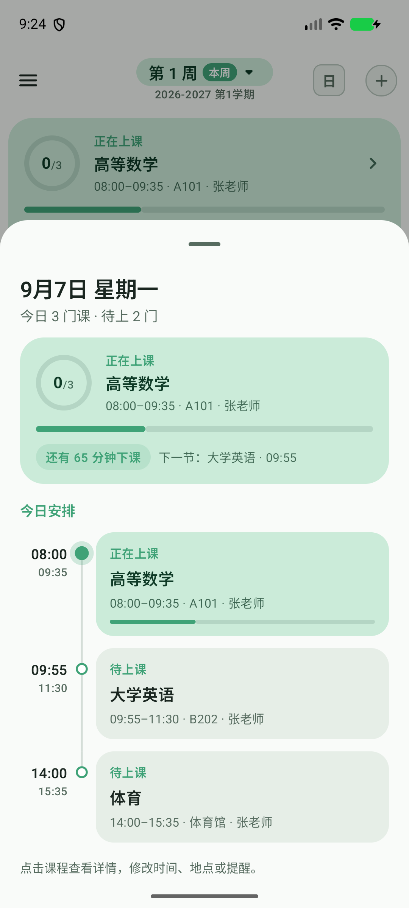
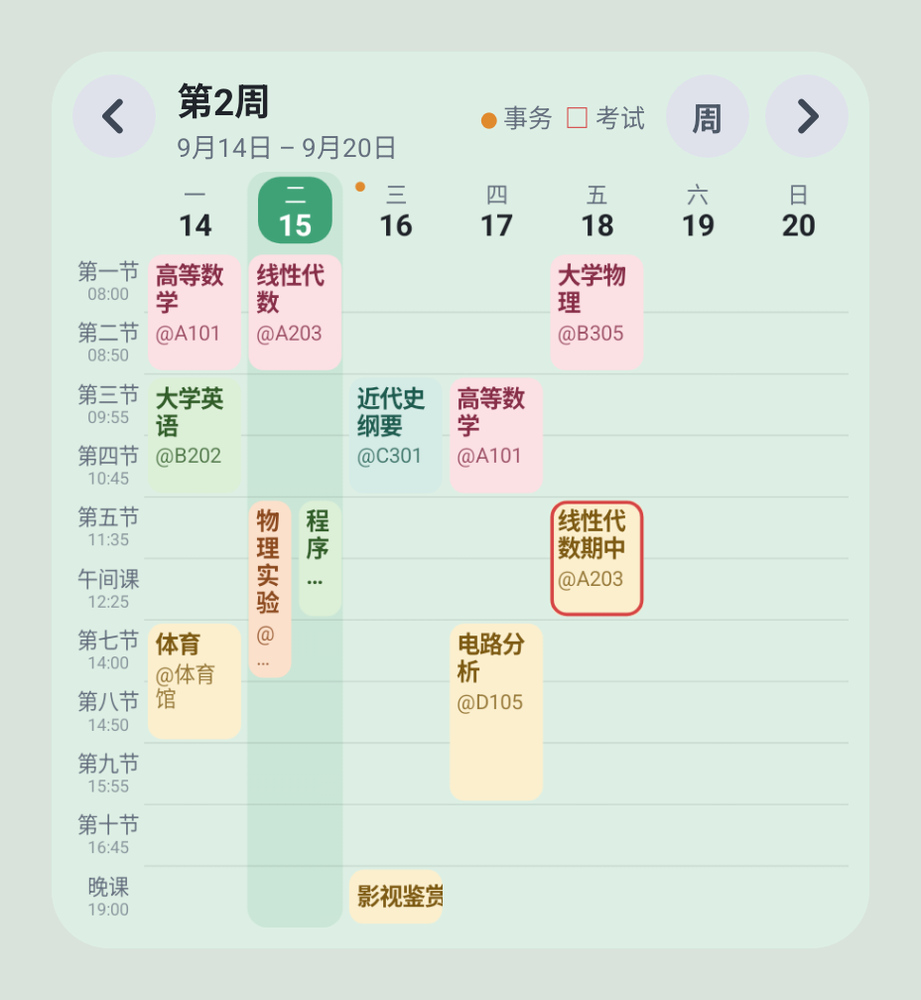
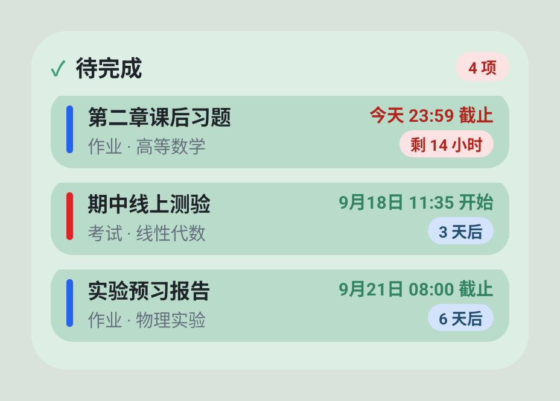
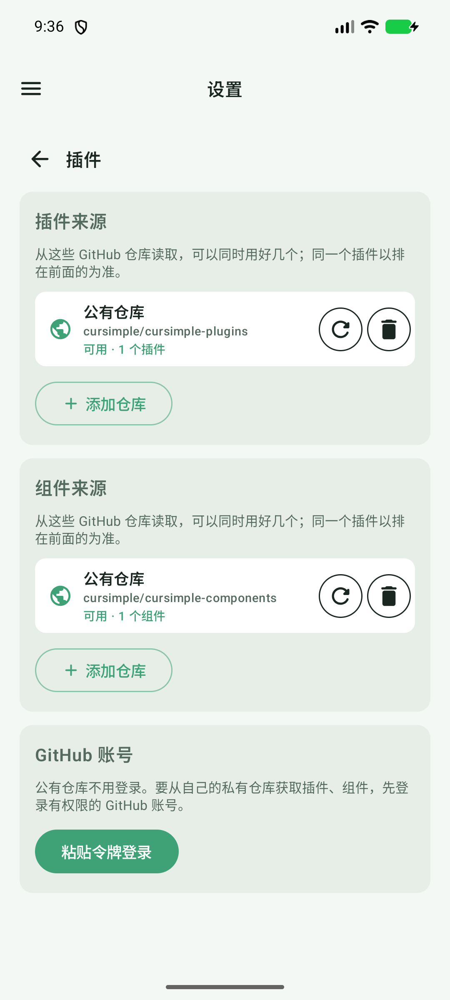
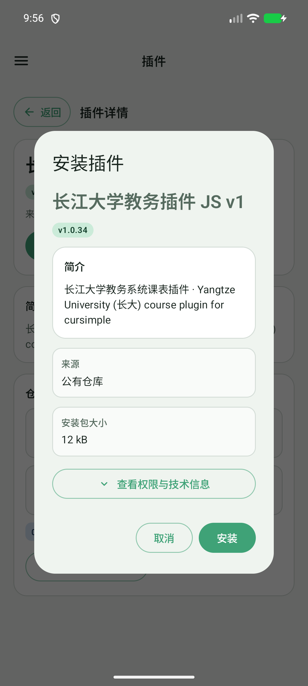
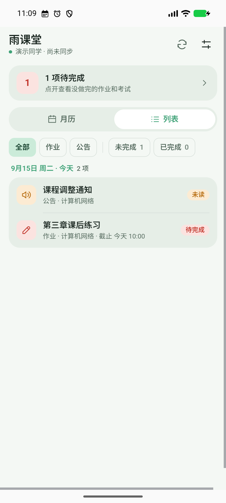
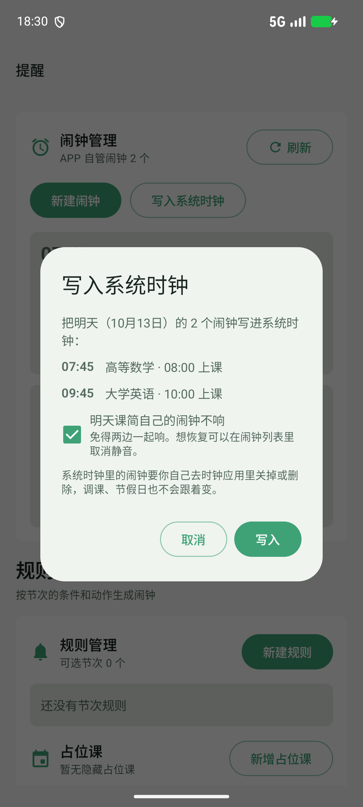
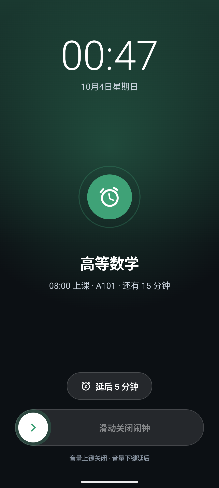

# 0.7.6 · 测试版

本次在 0.7.5 基础上完善组件、小组件、通知和更新检查，以 0.7.6 测试版发布。应用内开启「测试版更新」后可接收本次更新；公告继续沿用上一版演示截图，主要改动补充在文字中。

## 把今日安排看清楚

今天的日课表新增概览卡片，显示当前课程、下一节课和上下课倒计时。点开就是全天课程时间线，时间冲突也会单独提醒。

## 课表装进桌面日历

新增「课程日历」小组件，可以切换周课表和月历，查看课程、考试、事务与休息日。前后翻页、回到本周，以及点日期打开对应课表都更方便。

## 待完成的事随时看

笔记待办与组件自带小组件现在分开提供。笔记待办读取本地笔记；其他小组件的名称、界面和筛选由已安装且启用的组件自行声明，点开回到来源组件。下图沿用上一版演示画面。

## 插件和组件更好找

插件与组件都有清楚的「已安装／市场」入口，搜索能查名称、简介、学校别名和来源。卡片直接显示版本、来源与更新状态，手动刷新和安装前会重新检查版本。

## 自己的仓库也能用

插件来源和组件来源分别改成可增删的列表，默认公有仓库可以与额外来源一起用。同页登录 GitHub 令牌后，可以读取有权限的私有仓库；移除来源需要再次确认。

## 安装信息先看重点

详情页收起分类切换，把简介、版本和仓库信息排清楚。安装先看简介、来源和实际包大小，权限与技术信息按需展开；弹窗大小固定，只在内部滚动，大包提供真实下载进度。

## 笔记内容一搜就到

备忘录右上角新增搜索，支持标题、完整正文和课程信息，其他笔记本和已完成笔记也能找到。清空或关闭后回到原来的筛选，搜索框、按钮与确认框统一复用应用现有样式。

## 组件带上自己的页面

新增扩展组件接口，支持组件自带登录、设置、月历和列表页面。课简可承接新内容通知、截止提醒与课表事务，并把未完成内容显示在桌面。下图沿用上一版的本地雨课堂 v1.2.0 演示截图；组件需独立安装，本次应用发布不包含该组件包。

## 明天闹钟交给系统时钟

闹钟页新增「写入系统时钟」，把明天可写入的闹钟交给手机时钟，同一分钟的项目会合并。全部送出后可选择静音课简明天的闹钟，列表里也能取消静音。

## 响铃界面重新整理

闹钟响起时，时间、日期和课程信息更清楚，配色跟随应用主题。底部滑动关闭减少误触，也修正了滑到底仍无法关闭的问题。

## 假日、无课与提醒

- 假日闹钟默认按放假规则跳过，单个闹钟可以选择「节假日也响」；手动静音日期仍优先，并能在列表里取消。
- 假期前晚可查看第二天被跳过的闹钟；被跳过的闹钟不再提前发送响铃预告。
- 无课、下课、假日和没有任务时，今日概览及小组件多了一些轻松的提示。同一天同类提示保持稳定，第二天再换一句。
- 上课提醒新增诊断入口，补充部分手机的横幅、锁屏和后台弹出引导；滑动收起提醒后，通知栏里的内容仍会保留。

## 排版与细节

- 顶部图标、搜索框、带框按钮、仓库信息框和删除确认框改用共用控件，尺寸与文字更统一。
- 课程日历和待完成小组件单独分类；事务详情较长时可以在容器里滚动。
- 默认周数统一为 20 周，仍可调整为更长学期；周次切换和部分小组件箭头也做了排版修整。
- 公有来源与额外来源分别加载，一个来源不可用时不会遮住其他来源的结果。GitHub 令牌加密保存在当前手机，不随备份迁移。

## 修复

- 补齐 Android 7 的锁屏提醒与通知兼容处理，修正语言切换后的状态文字和月历标题。

- 修复小组件在编辑或删除导入课程后重复显示、旧课程重新出现的问题。
- 修复移入课程绕过假日或静音规则、跨周调课通知显示错误地点的问题。
- 修复组件页面滑动时误打开侧边栏，以及长正文滚动受影响的问题。
- 修复市场刷新和安装时沿用旧版本信息的问题，并避免已知较新版本被旧清单覆盖。

## 使用说明

默认 GitHub 登录使用令牌；[雨课堂 v1.3.1](https://github.com/cursimple/YuKeTang_notice_plugin/releases/tag/v1.3.1) 与[多平台通知 v1.2.3](https://github.com/cursimple/cursimple-notify-component/releases/tag/v1.2.3) 已独立发布，可另行安装。系统时钟写入后请打开手机时钟核对，之后的调课或假日变化不会自动修改已写入的闹钟。组件小组件需要安装并启用明确声明了小组件的组件，笔记待办则独立提供，后台同步仍受系统与网络影响。

## 这次补充的功能与修复

在上一版功能基础上，本版补充了以下内容：

- **组件接口 API 9 与自带小组件**：组件可以自行声明、绘制和管理桌面小组件。课简只提供通用数据、渲染、桌面绑定、生命周期和跳转接口；小组件只在对应组件安装并启用后出现。雨课堂待办、笔记待办分别由各自来源管理，界面和内容规则不会混在一起。
- **小组件可靠性**：默认按四列适配桌面，支持不同尺寸、字体大小、中英文和深色模式；修复小尺寸裁切、来源串用、点击范围和停用、升级、卸载后的残留问题。
- **插件安装防护**：APK 在写入前校验插件接口版本和最低课简版本，不兼容的插件或组件直接拦截；失败时不写入文件、不创建安装记录，升级失败保留原版本。
- **组件和插件更新**：按设置在打开课简时静默检查软件、插件和组件版本，发现新版以红点提示；检查进度只显示在对应条目，其他插件不会一起显示检查中。更新公告支持预加载，避免打开页面时长时间等待。
- **组件管理与下载**：已安装组件可直接查看详情、大小占用和安装时间，并由软件直接移除；GitHub 下载优化了镜像选择、完整性校验和失败回退。
- **组件通知能力**：支持微信、QQ、飞书、企业微信、钉钉、邮箱及常见推送服务等多平台、多目标通知，显示分阶段发送状态。
- **雨课堂内容操作**：公告已读必须经过官方确认并回查状态；逾期内容支持默认关闭的自动忽略，以及详情页手动忽略和恢复。
- **文档与官网**：官网支持简体中文、繁体中文和 English，默认中文；更新公告翻页、滚动条和本地预加载逻辑已修正。

上述功能需要相应组件支持；雨课堂和多平台通知组件仍独立安装、独立更新。
